CUDA Path Tracer
================

**University of Pennsylvania, CIS 565: GPU Programming and Architecture, Project 3**

* Josh Kim
* [LinkedIn](https://www.linkedin.com/in/euikwang-kim), [GitHub](https://github.com/Josh0323/Project3-CUDA-Path-Tracer)
* Tested on: Ubuntu 22.04.5 LTS, Intel Xeon @ 2.30GHz (4 vCPUs) 15GB, Tesla T4 15360MB (Google Cloud n1-standard-4 VM)

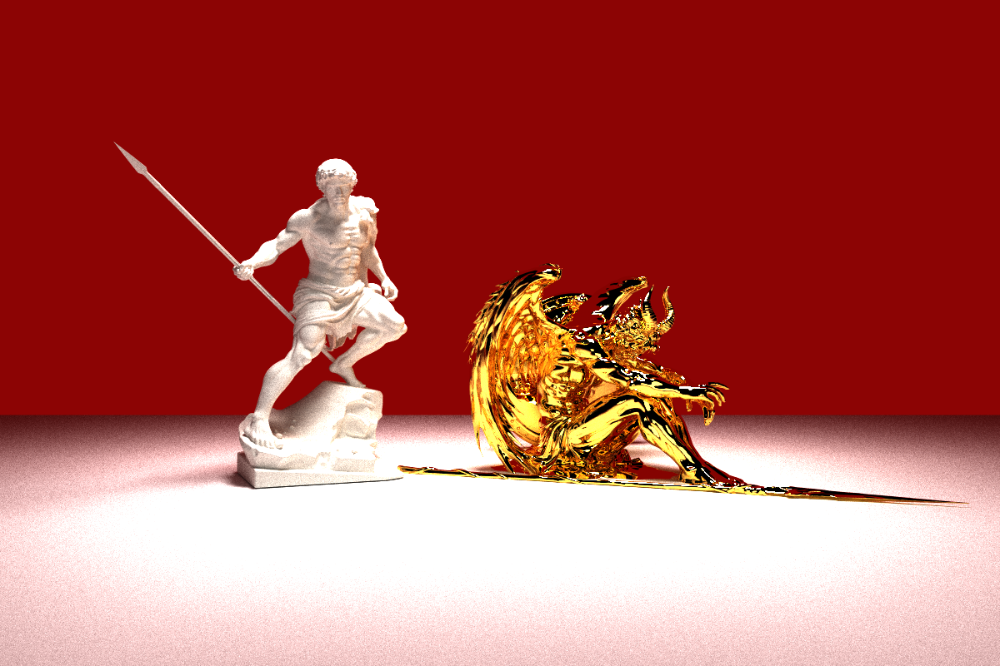

*Perseus and Satan, 5,112,351 triangles. `scenes/cover.json`, 10,000 iterations at 1200 x 800.*

A path-traced renderer written in C++ and CUDA. It loads glTF meshes and builds a BVH acceleration structure over them.

Path tracing works out the color of a pixel by following light backwards. A ray leaves the camera through the pixel and bounces from surface to surface, taking on each surface's color until it hits a light or runs out of bounces. One path is only a noisy guess, so each pixel is the average of thousands of them. Here every path runs on its own GPU thread.

**Features**

* **Visual improvements:** diffuse and mirror surfaces, antialiasing, depth of field
* **Mesh improvements:** glTF mesh loading with bounding box culling
* **Performance improvements:** BVH, Russian roulette, stream compaction, sorting paths by material

## Visual Improvements

### Diffuse and mirror surfaces

| Ideal diffuse | Perfect specular |
|:--:|:--:|
| 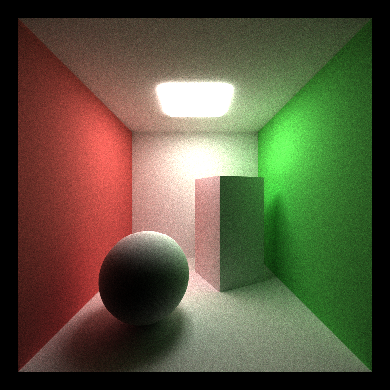 | 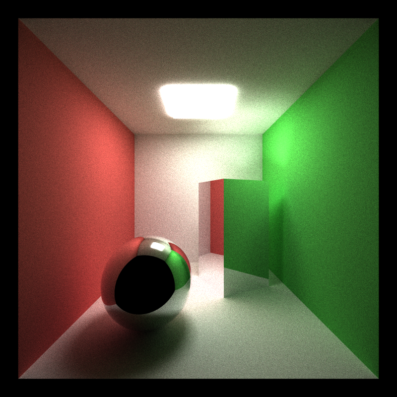 |

How a surface looks comes down to where it sends the light that hits it. An ideal diffuse surface scatters light in every direction, which gives the flat, matte look of paper or chalk. A perfect specular sends it in exactly one direction, so you see a clean reflection.

### Stochastic Sampled Antialiasing

| Off | On |
|:--:|:--:|
|  | 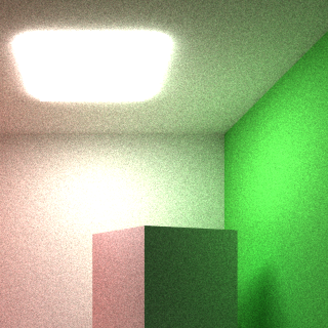 |

If every ray goes through the exact center of its pixel, a pixel on an edge is either fully one surface or fully the other. Slanted lines then come out as a staircase. Antialiasing smooths them by letting a pixel on an edge take a mix of the two colors.

Here each iteration shoots the ray through a random point inside its pixel instead of through the center. Over many iterations the pixels along an edge average out to a smooth gradient. The cost is two random numbers per ray, which does not show up in the timing: 41.9 ms per iteration with it off and 41.7 ms with it on.

### Physically-based Depth of Field

| Focal distance 7.3 | Focal distance 10.5 | Focal distance 13.7 |
|:--:|:--:|:--:|
|  | 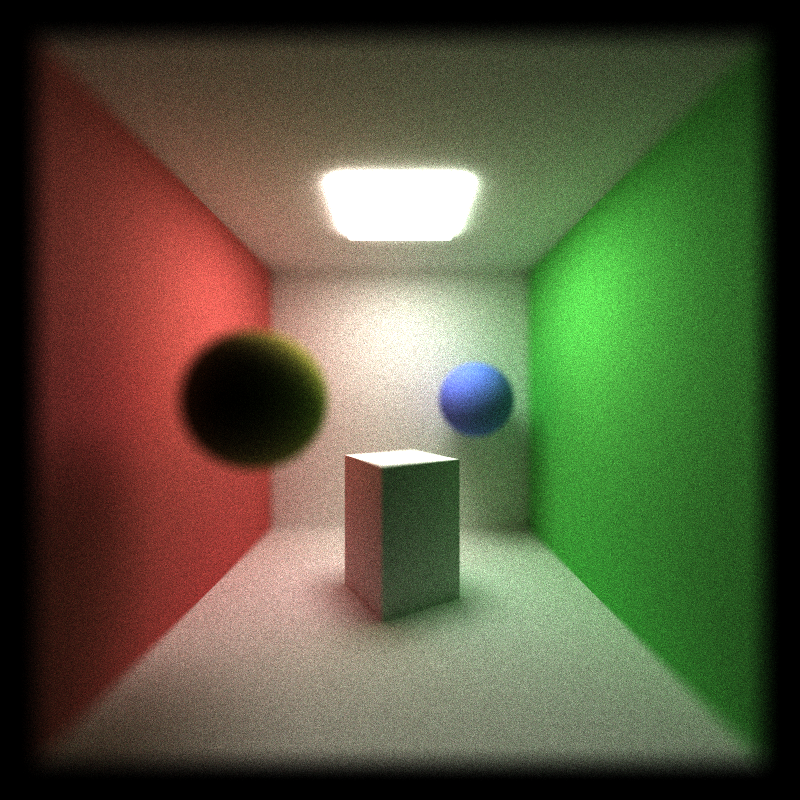 |  |

A pinhole camera keeps everything sharp no matter how far away it is. Real cameras don't, so I replaced the pinhole with the thin lens model from [PBRT 5.2.3](https://pbr-book.org/4ed/Cameras_and_Film/Projective_Camera_Models#TheThinLensModelandDepthofField). It has two settings, a lens radius and a focal distance. Objects at the focal distance stay sharp, and anything nearer or farther blurs, more so with a bigger lens.

To get that, each camera ray starts from a random point on the lens disk instead of from one fixed point, and is aimed at the spot where the pinhole ray would cross the focal plane. All the rays of a pixel meet at the focal distance and spread apart everywhere else, which is what makes the blur.

It is almost free. The only added work is two random numbers per camera ray, and the time per iteration went from 28.2 ms with the pinhole to 28.7 ms with the lens.

## Mesh Improvements

### glTF mesh loading

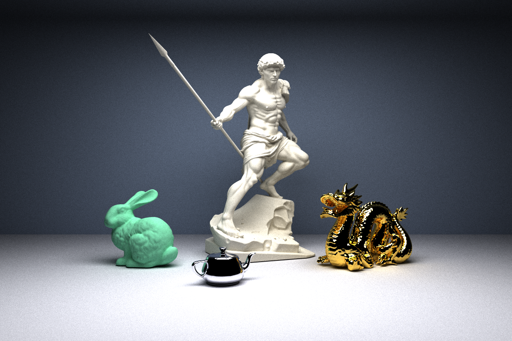

*Four glTF meshes, 3,708,847 triangles in total: the Stanford bunny, Perseus, the Utah teapot and the Stanford dragon. `scenes/lineup.json`, 5000 iterations at 1200 x 800.*

Spheres and cubes only go so far, so the renderer also loads triangle meshes from glTF files (`.gltf` or `.glb`) using [tinygltf](https://github.com/syoyo/tinygltf). A glTF file describes a scene as a tree of nodes, each with its own transform and mesh. At load time every node's transform, plus the object's transform from the scene file, is applied to its vertices, so the GPU gets one flat list of world-space triangles. Vertex normals are interpolated across each triangle, which is why curved models look smooth instead of faceted. A mesh takes a single material from the scene file. Textures and the materials stored in the glTF are not read.

Rays are tested against triangles with [Möller-Trumbore](https://en.wikipedia.org/wiki/M%C3%B6ller%E2%80%93Trumbore_intersection_algorithm). Each mesh also has a bounding box, and a ray that misses the box skips all of that mesh's triangles. On its own that only saves 26% on Perseus, because a ray that does enter the box still tests every triangle. The BVH in the next section is what makes large meshes practical, and the timings for both are in the table there.

## Performance Improvements

### Bounding Volume Hierarchy (BVH)

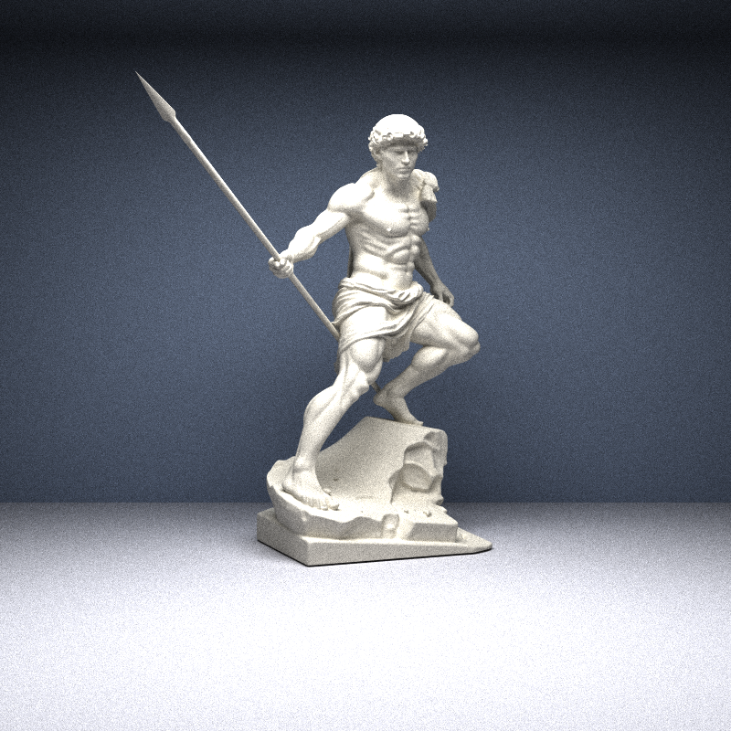

*The test scene: Perseus alone, 2,752,386 triangles. `scenes/perseus_open.json`, 2000 iterations.*

Without any optimization, a ray has to be tested against every triangle of a mesh to find the one it hits. For Perseus that is 2.7 million tests per ray, for 640,000 rays, on every bounce. A BVH removes almost all of that work. It puts small groups of triangles in boxes, puts those boxes in bigger boxes, and keeps going until one box holds the whole mesh. A ray starts at that top box and only descends into the boxes it actually hits, so it ends up testing a handful of triangles instead of all of them.

Mine is built on the CPU when the scene loads, one tree per mesh. Each split is picked with a binned surface area heuristic (16 bins per axis), and a node with 4 triangles or fewer becomes a leaf. Perseus's tree has 1,716,029 nodes, is 29 levels deep and takes 2.3 seconds to build. The GPU has no recursion, so each ray walks the tree with a small fixed-size stack. It visits the nearer child first and skips any box that starts beyond its closest hit so far. [Jacco Bikker's guide](https://jacco.ompf2.com/2022/04/13/how-to-build-a-bvh-part-1-basics/) is a good walkthrough of this kind of BVH.

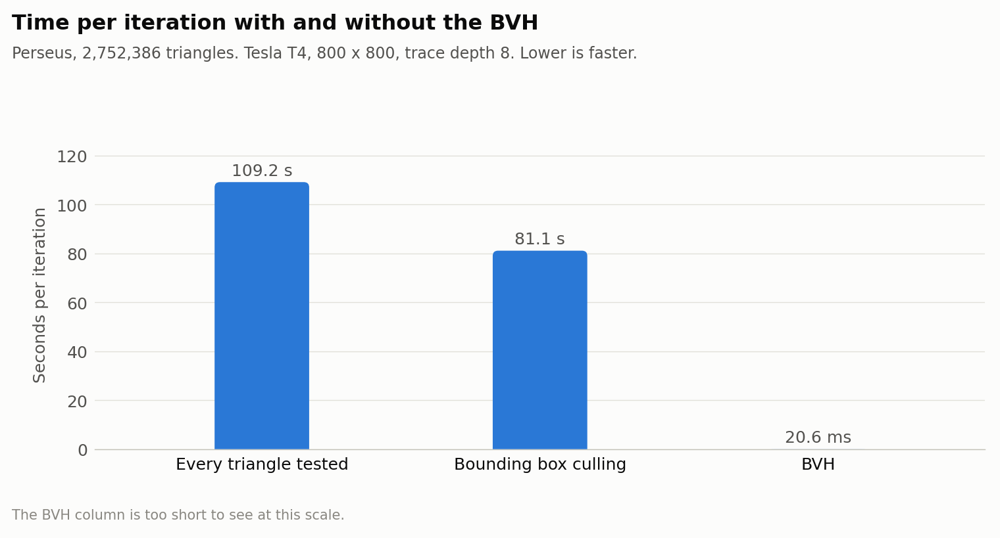

| Method | Time per iteration |
|---|--:|
| Every triangle tested | 109.2 s |
| Bounding box culling only | 81.1 s |
| BVH | 20.6 ms |

With the BVH, Perseus renders about 5,300 times faster than testing every triangle and about 3,900 times faster than box culling alone. Box culling by itself only saves 26%, because a ray that enters Perseus's box still tests all 2.7 million triangles. The two slow rows are averages over 2 iterations each, since one iteration takes over a minute. The BVH row is two runs of 500 iterations.

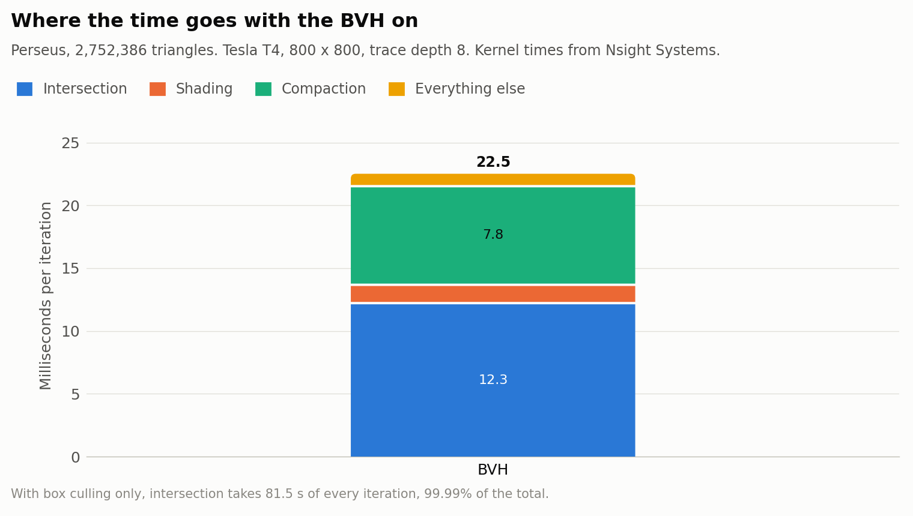

Nsight Systems shows where the time goes. Without the BVH, the intersection kernel takes 81.5 seconds of every iteration, 99.99% of the total. With it, intersection drops to 12.3 ms, a little over half of the iteration, and stream compaction becomes the next biggest cost at 7.8 ms. Nsight's total is a little higher than the 20.6 ms above because it also counts ray generation, the final gather, and the copy to the preview window.

### Stream compaction

A path can end before it has used all of its bounces: it hits a light, or it leaves the scene. On the GPU a finished path still takes up a thread in every later kernel unless something removes it. Stream compaction does that. After each bounce, `thrust::stable_partition` moves the paths that are still alive to the front of the array, and the next bounce only launches threads for those.

How much that helps depends on how many paths end early, so I timed it on the same scene twice: open, and closed in with walls like a Cornell box. Russian roulette is off in this section so that compaction is the only thing removing paths.

| Open scene | Closed scene |
|:--:|:--:|
|  | 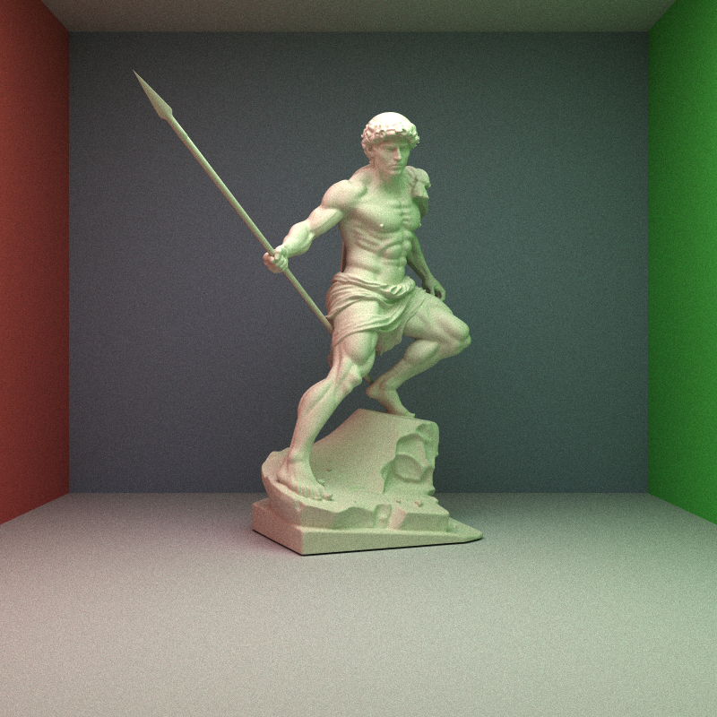 |

*`scenes/perseus_open.json` and `scenes/perseus_closed.json`, 2000 iterations each. The closed one adds a red wall, a green wall, a ceiling and a wall behind the camera.*

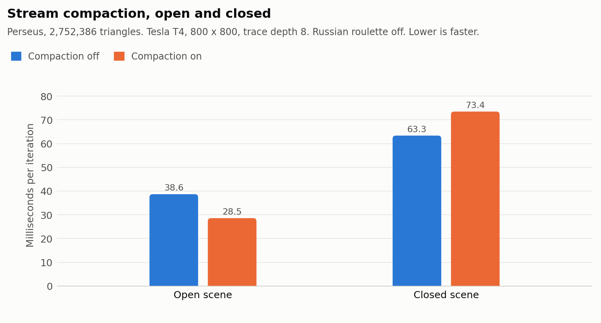

| ms per iteration | Compaction off | Compaction on | |
|---|--:|--:|--:|
| Open scene | 38.6 | 28.5 | 26% faster |
| Closed scene | 63.3 | 73.4 | 16% slower |

Compaction makes the open scene 26% faster and the closed scene 16% slower. I expected no gain in the closed scene, but not a loss.

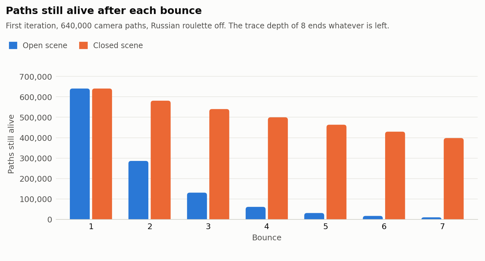

The path counts explain it. In the open scene more than half of the paths are gone after the second bounce, and only 9,095 of the 640,000 are left after bounce 7. In the closed scene a path can only end by hitting the light, so 397,288 of them (62%) are still alive at that point.

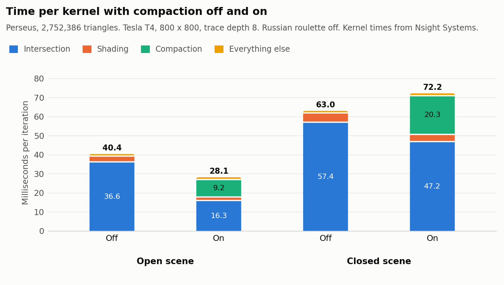

Nsight Systems shows the trade. The partition takes 9.2 ms per iteration in the open scene and 20.3 ms in the closed one, where it has far more paths to move. In the open scene it pays for itself, because intersection drops from 36.6 ms to 16.3 ms. In the closed scene intersection only drops from 57.4 ms to 47.2 ms, which is less than the partition costs.

### Russian roulette

| Roulette off | Roulette on |
|:--:|:--:|
|  |  |

*The closed scene, 2000 iterations each. The picture should not change, only the time.*

[Russian roulette](https://pbr-book.org/3ed-2018/Monte_Carlo_Integration/Russian_Roulette_and_Splitting) ends paths early at random. A path that has bounced a few times has usually lost most of its energy and cannot add much to its pixel, but it costs just as much to trace as a bright one. So after each bounce a path survives with a probability equal to its brightest color channel, which makes dim paths the most likely to be dropped. The survivors are divided by that probability to make up for the ones that were removed, and that keeps the average the same. As a check, the mean color of the two images above differs by less than 0.01%.

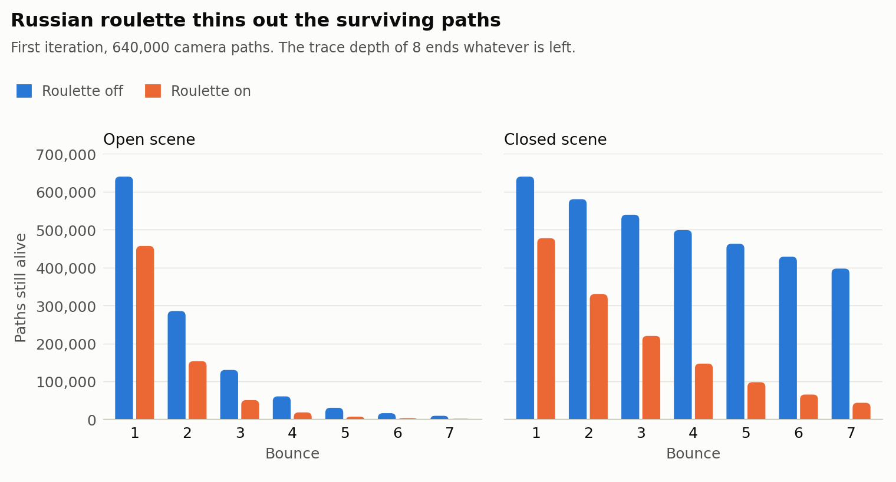

**After bounce 7, roulette leaves 1,293 paths alive instead of 9,095 in the open scene, and 43,399 instead of 397,288 in the closed one.** These are the same two Perseus scenes as in the stream compaction section.

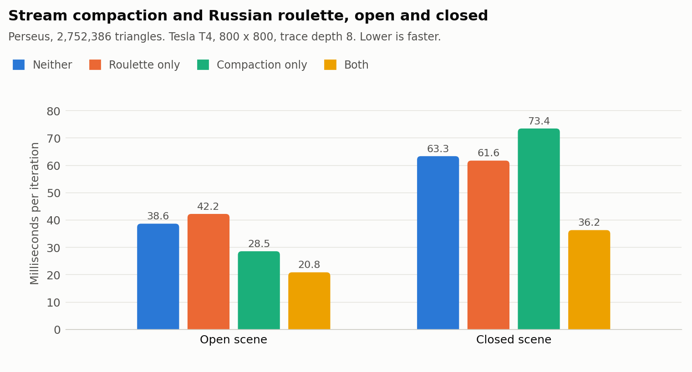

| ms per iteration | Neither | Roulette only | Compaction only | Both |
|---|--:|--:|--:|--:|
| Open scene | 38.6 | 42.2 | 28.5 | 20.8 |
| Closed scene | 63.3 | 61.6 | 73.4 | 36.2 |

**On its own, roulette does not help: the open scene gets 3.6 ms slower and the closed scene only 1.6 ms faster.** Without compaction a killed path stays in the array, and the intersection kernel still runs for every path in it, alive or not. Only the shading is skipped, and shading is cheap. This is where the GPU differs from a CPU. On a CPU a killed path simply stops and the saving is immediate. On the GPU it only shows up once the array is repacked.

**With stream compaction on, roulette saves 7.7 ms per iteration in the open scene (27%) and 37.2 ms in the closed one (51%).** The closed scene gains the most because nothing else ends a path early there. It also fixes the problem from the last section: compaction alone made the closed scene 10.1 ms slower than doing nothing, and the two together make it 27 ms faster.

### Sorting paths by material

After a bounce, paths that sit next to each other in the array have usually hit different materials. On a GPU, threads that run side by side but take different branches of the shader slow each other down. Sorting is meant to fix that. With `SORT_BY_MATERIAL` on, `thrust::sort_by_key` orders the paths by material id before shading, so neighboring threads run the same branch.

I timed it on the two Perseus scenes and on the lineup from the mesh section, which has the most varied materials: seven, two of them mirrors.

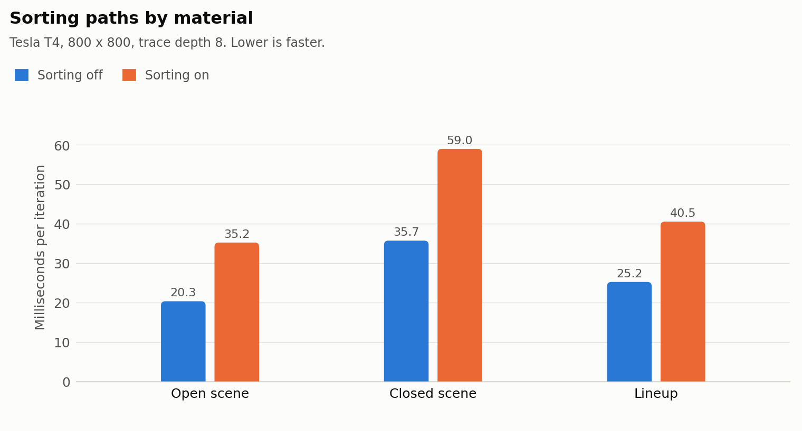

| ms per iteration | Sorting off | Sorting on | |
|---|--:|--:|--:|
| Open scene | 20.3 | 35.2 | 14.9 ms slower |
| Closed scene | 35.7 | 59.0 | 23.3 ms slower |
| Lineup | 25.2 | 40.5 | 15.3 ms slower |

**Sorting made every scene slower, by 15 to 23 ms per iteration.**

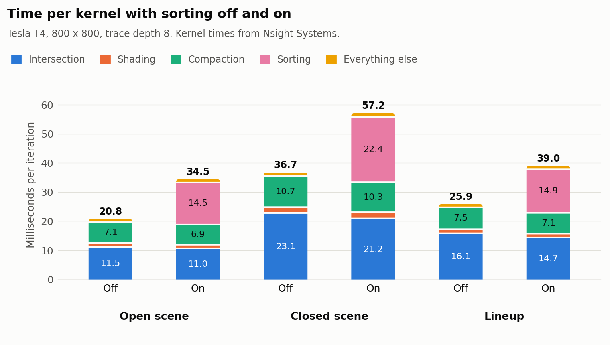

**The sort itself takes 14.5 to 22.4 ms per iteration, while the whole shading kernel it is meant to help takes between 1.3 and 2.2 ms.** The shader only has three cheap cases (light, diffuse and mirror), so there is almost no divergence to remove, and with sorting on its time changes by about 0.1 ms. The sort, on the other hand, has to move every live path and its intersection record on every bounce.

I would expect sorting to pay off with many materials whose shading code is long and different from each other, such as textured or layered ones. Until then it stays off by default.

## Notes

The switches are `#define`s at the top of `src/pathtrace.cu`: `STREAM_COMPACTION`, `SORT_BY_MATERIAL`, `ANTIALIASING`, `MESH_BOUNDS_CULLING`, `BVH_ACCELERATION`, `RUSSIAN_ROULETTE`, and `PRINT_PATHS_PER_BOUNCE` for the path counts above. The BVH's bin count, leaf size and depth limit are in `src/bvh.h`.

The only change to `CMakeLists.txt` is adding `src/bvh.h` and `src/bvh.cpp` to the file lists.

Two models are too large to keep in this repository. `scenes/cover.json` needs both of them, and `scenes/lineup.json`, `scenes/perseus_open.json` and `scenes/perseus_closed.json` need Perseus. Download them from the Sketchfab pages linked in the credits and save them as `scenes/models/perseus/source/Greek Sculpture.glb` and `scenes/models/satans-fall-to-hell/source/Satan's Fall to Hell.glb`.

## Credits

* [tinygltf](https://github.com/syoyo/tinygltf) v2.9.7 by Syoyo Fujita and contributors, MIT license, in `external/include/tiny_gltf.h`.
* `Box.glb` by Cesium, CC BY 4.0, and Suzanne (glTF version by Norbert Nopper, CC0), both from the [Khronos glTF Sample Assets](https://github.com/KhronosGroup/glTF-Sample-Assets).
* ["Perseus"](https://skfb.ly/pFxVL) by leofinearts, licensed under [Creative Commons Attribution](http://creativecommons.org/licenses/by/4.0/). It is rendered here with a single material, without its textures.
* ["Satan's Fall To Hell"](https://skfb.ly/pFByu) by leofinearts, licensed under [Creative Commons Attribution](http://creativecommons.org/licenses/by/4.0/). Also rendered with a single material, and with its round base sunk below the floor.
* Stanford dragon and Stanford bunny from the [Stanford 3D Scanning Repository](http://graphics.stanford.edu/data/3Dscanrep/), Stanford University Computer Graphics Laboratory.
* Utah teapot, originally by Martin Newell, in the version from the [McGuire Computer Graphics Archive](https://casual-effects.com/data/), CC0.
* [PBRT 5.2.3](https://pbr-book.org/4ed/Cameras_and_Film/Projective_Camera_Models#TheThinLensModelandDepthofField) for the thin lens and [PBRT 13.7](https://pbr-book.org/3ed-2018/Monte_Carlo_Integration/Russian_Roulette_and_Splitting) for Russian roulette.
* [How to build a BVH](https://jacco.ompf2.com/2022/04/13/how-to-build-a-bvh-part-1-basics/) by Jacco Bikker, a walkthrough of the kind of BVH used here.
* [Möller-Trumbore](https://en.wikipedia.org/wiki/M%C3%B6ller%E2%80%93Trumbore_intersection_algorithm) for the ray-triangle test.
